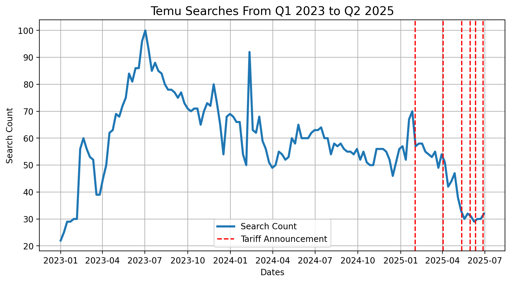
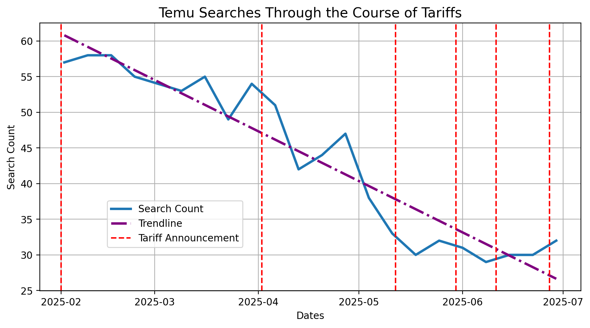

# Analysis of E-Commerce Sales and the Impact of Tariffs

## Table of Contents
- [Project Background](#Project-Background)
- [Tariffs Affecting E-Commerce From China](#Tariffs-Affecting-E-Commerce-From-China)
- [Quarter on Quarter Growth](#Quarter-on-Quarter-Growth)
- [Revenue Based Analysis](#Revenue-Based-Analysis)
- [Gross Margin and Tariffs](#Gross-Margin-and-Tariffs)
- [Marketing Efficiency Ratio](#Marketing-Efficiency-Ratio)
- [The Operating Margin](#Operating-Margin)
- [Trends In Investments and Net Cash Over Time](#Trends-In-Investments-and-Net-Cash-Over-Time)
- [Trend in Public Interest](#Trend-In-Public-Interest)
- [Recommendations](#Recommendations)
- [Clarifications](#Clarifications)
- [Acknowledgments](#Acknowledgements)

## Project Background
TEMU, the 2nd ranked E-Commerce site has seen recent growth amongst the general public as a result of its convenience and affordability, posing as a competitor to Amazon. Being a Chinese site, it is affected by new tariffs. This project analyzes the effects of tariffs and gives possible solutions to minimize the effects of tariffs on profitability.

## Tariffs Affecting E-Commerce From China
Data from TEMU's profits for the 2nd quarter has been made available, and thus data from 2024 Q3 to 2025 Q2 is used. As such, the effect of tariffs only up to June 30th is used. Following is a simple timeline of tariffs passed relevant to e-commerce from China.

## Quarter on Quarter Growth

## Revenue Based Analysis

### Gross Margin and Tariffs

### Marketing Efficiency Ratio

### The Operating Margin

## Trends In Investments and Net Cash Over Time

## Trend in Public Interest
Currently, TEMU - for reasons related to security - do not publically publish data relating to customer retentionm or any sort of marketing related metrics. As such, interpolation on the use of TEMU is based on data provided from Google Trends from the beginning of Q1, 2023 to Q2, 2025. 

The following graphic shows a noticeably downwards trend in the popularity of TEMU. The red marking represent dates at which new tariffs were imposed. One can note a clear of popularity after July 2023, and a subsequent semi-consisten period of an average amount of searches until a spike around the beginning of 2025 and a continuous downwards trend soon after.

A more refined analysis of the search behavior of potential and current customers shows a continuous downward trend that is consequent of the announcement of tariffs beginning on February 2nd, 2025. The most notable effect of tariffs was in that parcels (one of the more attractive selling points) would no longer be able to sell at reduces prices, and thus have to sell at prices similar to that american companies. Along with that growing distrust in Temu arrived as a result of questions concerning data privacy and the potential of getting low-quality products. These two factors are likely to have resulted in individuals losing trust in the company and having no financial incentive to outweigh their distrust in the foreign company. As such, the amount of traffic received by temu has significantly decreased since the beginning of 2025:

## Recommendations

Being a foreign site, TEMU must not only face tariffs, but also a growing sense of distrust amongst individuals worried about the security of their data. Their ability to give foreign clients trust in their system is largely limited by the amount of people who will relate their negative experiences; stories that are likely to gain more and more traction amongst social media. This issue has always existed, but customers likely chose to ignore the risks to their data as a compromise to the low prices of attractive items sponsored through social media sites like TikTok. Since tariffs have reduced this aspect, TEMU must instead choose to continue to reach out to content creators and influencers, and buy advertisement spots across all forms of media in order to retain some trust and keep an image of the brand in the memory of people.

## Clarifications

## Acknowledgments
